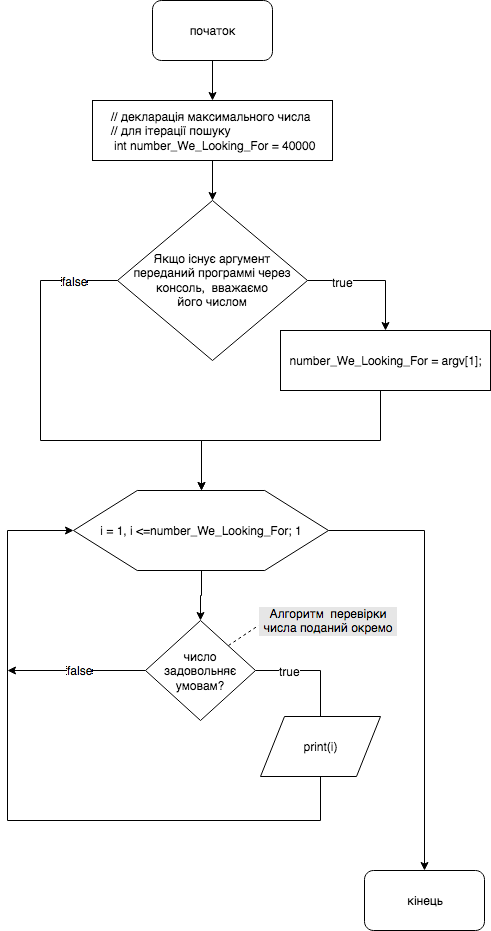

## Лабораторна робота 1

Дано натуральне число _n_. Серед чисел _1, ..., n_ знайти такі числа, запис яких співпадає з останніми цифрами запису їх квадрату.

Наприклад:
  * 6  (6<sup>2</sup> = 36)
  * 25 (25<sup>2</sup> = 625) і т.д.


### Виконання Лабораторної роботи

* [x] 1. Проаналізувати умову задачі
* [x] 2. Створити альгоритм розв'zзання задачі згідно з номерос варіанту, оформити його у графічному вигляді (у вигяді блок схеми).
* [x] 3. Рoзробити програмний продукт
* [x] 4. Протестувати програмний продукт на контрольних прикладах, зробити висновки стосовно подальших можливостей його удосконаленя.
* [x] 5. Результати роботи оформити протоколом.


### 1. Умова задачі.

1. Обійти числа з _1, ..., n_ включно
2. Знайти ті що задовольняють умовам задачi:
3. Умова задачі: Запис числа має співпадати з останніми цифрами запису їх квадрату
  * 6  (6<sup>2</sup> = 36)
  * 25 (25<sup>2</sup> = 625) і т.д.

### 2. Алгоритм розв'язання задачі

##### Власне алгоритм фінального програмного продукту


##### Алгоритм перевірки числа задачам умови


```python
# Алгоритм перевірки буде полягати в наступному
#
def NaturalRootedNumbers(number):
    """
    :type number: int
    :rtype: bool
    """

    # Піднесемо число до квадрату та віднімемо це число з результату:
    #   в такому разі нам буде відомо чи кратне воно числу 10
    #   якщо ні то далі шукати нема сенсу,
    #     оскільки число не задовольняє умовам
    #   якщо так - працюємо далі!

    base = (number**2) - number;
    if base % 10 != 0:
        return False;

    # Знайдемо розряд числа що ми шукаємо
    # посупово збільшуєчи степінь числа 10 і перевіряючи
    # остачу від ділення.
    # коли остача від ділення дорівнює власне числу
    #   ми знаємо розряд.
    i = 0;
    while number % ( 10 ** i ) != number:
        i += 1;

    # на останок знову перевіряємо остачу від ділення
    # нашого базису (різниці квадрату числа і числа)
    # і 10 в рохряді нашого числа.
    # OK    (625-25) % 100 == 0
    # FAIL  (121-11) % 100 != 0
    if base % 10**i != 0:
        return False

    return True
```

### 3. Рoзробити програмний продукт

Код порграмного продукту подано в файлі `problem_1_v10.cpp`.

Компілювати наступним чином
```bash
c++ problem_1_v10.cpp -o ./nn
```


Передача параметра програмному пордукту імплементуєся через cli наступним чином
```bash
./nn 500000
```

### 4. Протестувати програмний продукт на контрольних прикладах, зробити висновки стосовно подальших можливостей його удосконаленя

Попереднє тестування проводилось в автоматичному режимі під час тестової імплементації алгоритму визначення чи сисло задовольняє умовам задачі і реалізаовувалось мовою програмування Python3.

Фінальний програмний продукт було протестовано в ручному режимі.

Можливе покарщення алгоритму перевірки не представляється (мені) можливим:
* За умови реалізації рішення через конвертацію квадрату числа в масив char (або іншокажучи - строку) - саме перетворення буде мати більшу часову складність ніж розроблений варіант.
* Якщо ж прибрати перевірку остачі діленя за модулем різниці квадрату та числа що ми порводимо першою дією в нашому алгоритмі от це зменшить нашоу роботу на 1 ітерацію в 1 з 10 випадків, тобтонасправді погіршить швидкодію в 9 з 10 випадків.

### 5. Результати роботи оформити протоколом.
1. Що таке проста та складна інструкції

    В обох випадках інструкція або оператор - це команда мові програмування. Різниця між цими поняттями полягає у тому що складні інструкції складаються з простих.
    Приклад складної інструкіцї: Знайти голку в копиці сіна
    Приклад простої інструкції: Це голка.

2. Цикл з передумовою, цикл з пост умовою. Їх синтаксис.

    ```
    // перед-умовний цикл
    while( умова циклу ) {
      // тіло циклу
    }

    // пост-умовний цикл
    do {
      // тіло циклу
    } while( умови циклу );
    // в різних мовах це може бути як умова продовження так
    // і умова перервання циклу
    ```

3. Що таке покроковий цикл.

    Це цикл який відбувається покроково і в якому проводиться перевірка умови. Зачаcту це цикл `for` що має насутпний синтаксис:

    ```cpp
    // де:
    //  int i = 0 - це ініціалізація кроку, що відбувається лише 1 раз спочатку цикла
    //  i < 10 це логічна умова входу в цикл
    //  i++ зміна кроку (в данному випадку інкрементація на 1)
    //  тіло циклу - власне тіло того що
    for ( int i = 0; i < 10; i++ ){
      // тіло циклу
    }
    ```

4. Коли виконується перемикач

    Перемикач або оператор `switch` корисний при виконання інструкіцї що має кілька варіантів виконання. У мові програмування C це констаннтний вираз тобто в умовах перевірки ми можемо лише перевіряти константи або умову по замовчуванню (та що буде попадати під всі варіанти), в інших мовах програмування можна перевіряти умови (Go), кілька варіантів в одній умові (Swift) тощо.

5. Призначення конструкцій продовження, безумовного переходу, повернення та переривання у циклах різного роду.

    Конcтрукції преривання власне роблять те для чого вони призначені - воня перенапрявляють поток виконання программи:

    * `continue` ініціалізує виконання циклу з перед і пост умовою умовою з тіли цього циклу (ну щоб не виконувати все тіло циклу коли необхідна умова в тіли циклу (не самого циклу) досягнуто ).
    * `break` конструкція виходу з циклу - у місці обяви вона прерве цикл  (приміняється тоді коли нам більше не потрібно виконувати цикл або потрібно перервати його виконання (напряклад для switch))

    `return` прязначений для повернення данних або сигналу функції що вона вже припинила роботу.

    `goto` оператор безумовного переходу. дозволяє несподівано змінювати порядок виконання по суті стрибачи до якої попередньо задекларовної мітки. вважається небезчечним саме по цій причині.
